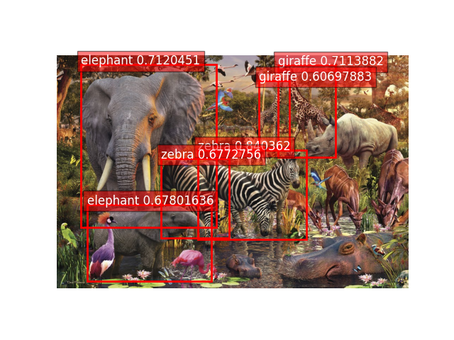
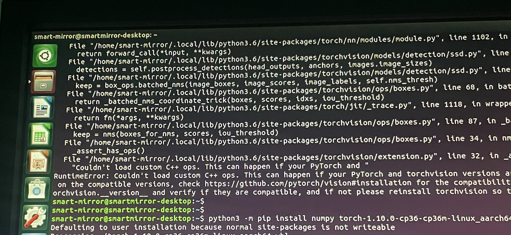
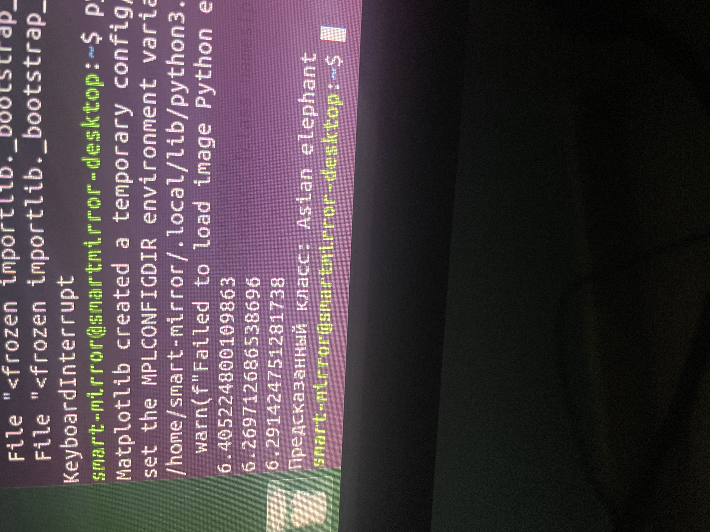
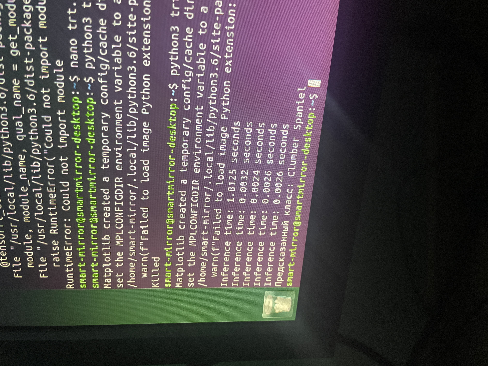

# Мобильные системы компьютерного зрения
## Лабораторная работа №4
### Выполнили: Ганыс, Реккубрацкий, Сидуков
### Преподаватель Денисов А.К.


Цель работы:
Изучить основы реализации глубоких нейронных сетей на мобильных
системах, а также методы их оптимизации.

Задание:
Задание:
1. Изучить принципы построения глубоких нейронных сетей, их
разновидности, архитектуры (применительно к обработке
изображений и видео).
2. Изучить способы реализации нейросетевых вычислений (CPU, GPU).
3. Реализовать систему обработки изображений на основе нейронной
сети (назначение и архитектуру сети выбрать самостоятельно, это
может быть предобученная сеть для детектирования объектов,
сегментации, классификации, построения карты глубины, вычисления
оптического потока). Реализация обучения сети не требуется.
Приложение должно принимать на вход реальное изображение
(изображения) и выводить результат
4. Оптимизировать выбранную сеть с помощью TensorRT.
5. Оценить следующие характеристики:
5.1 Время выполнения программы и количество используемой памяти
при использовании сети без оптимизации.
5.2 Производительность и потребление памяти при использовании
TensorRT.
5.3 Изменение выхода сети (числовых значений) при использовании
TensorRT при одинаковых входных данных.
5.4 Возможность применения реализованной системы в real-time
приложениях.

Отчёт должен содержать следующие пункты:
1) Теоретическая база
2) Описание разработанной системы (алгоритмы,принципы работы,
архитектура)
3) Результаты работы и тестирования системы(скриншоты,изображения,
графики, закономерности)
4) Выводы
5) Использованные источники


## Описание разработанной системы

Требовалось изучить принципы построения глубоких нейронных сетей
Для начала была выбрана популярная модель ssd300_vgg16

В качестве образца для тестирования было выбрано следующее изображение:


после выполнения следующего кода на cpu

```
import time

import requests
import torch
from PIL import Image
import torchvision.transforms as T
import matplotlib.pyplot as plt
from torchvision.models.detection import ssd300_vgg16


device = torch.device('cpu')

model = ssd300_vgg16(pretrained=True)
model = model.to(device)
model.eval()

COCO_CATEGORY_MAP = {
    1: 'person', 2: 'bicycle', 3: 'car', 4: 'motorcycle', 5: 'airplane', 6: 'bus',
    7: 'train', 8: 'truck', 9: 'boat', 10: 'traffic light', 11: 'fire hydrant',
    13: 'stop sign', 14: 'parking meter', 15: 'bench', 16: 'bird', 17: 'cat',
    18: 'dog', 19: 'horse', 20: 'sheep', 21: 'cow', 22: 'elephant', 23: 'bear',
    24: 'zebra', 25: 'giraffe', 27: 'backpack', 28: 'umbrella', 31: 'handbag',
    32: 'tie', 33: 'suitcase', 34: 'frisbee', 35: 'skis', 36: 'snowboard',
    37: 'sports ball', 38: 'kite', 39: 'baseball bat', 40: 'baseball glove',
    41: 'skateboard', 42: 'surfboard', 43: 'tennis racket', 44: 'bottle',
    46: 'wine glass', 47: 'cup', 48: 'fork', 49: 'knife', 50: 'spoon', 51: 'bowl',
    52: 'banana', 53: 'apple', 54: 'sandwich', 55: 'orange', 56: 'broccoli',
    57: 'carrot', 58: 'hot dog', 59: 'pizza', 60: 'donut', 61: 'cake',
    62: 'chair', 63: 'couch', 64: 'potted plant', 65: 'bed', 67: 'dining table',
    70: 'toilet', 72: 'tv', 73: 'laptop', 74: 'mouse', 75: 'remote',
    76: 'keyboard', 77: 'cell phone', 78: 'microwave', 79: 'oven', 80: 'toaster',
    81: 'sink', 82: 'refrigerator', 84: 'book', 85: 'clock', 86: 'vase',
    87: 'scissors', 88: 'teddy bear', 89: 'hair drier', 90: 'toothbrush'
}


# Пример с изображением
image_url = 'https://media.licdn.com/dms/image/C4E12AQF_ByjCF7GXPA/article-cover_image-shrink_720_1280/0/1556841823396?e=2147483647&v=beta&t=h9jsPASZ_wcxcl1cv35ab4IE6WlB9Lshpo85SYu1bdM'  # Замените ссылкой на изображение


# Функция для предобработки изображения
def preprocess_image(image_path):
    image = Image.open(requests.get(image_path, stream=True).raw).convert("RGB")
    transform = T.Compose([T.ToTensor()])
    return image, transform(image).unsqueeze(0).to(device)


# Функция для обработки вывода модели
def postprocess_output(output, threshold=0.5):
    # Сохраняем только те объекты, уверенность по которым выше threshold
    boxes = output[0]['boxes'].detach().cpu().numpy()
    scores = output[0]['scores'].detach().cpu().numpy()
    labels = output[0]['labels'].detach().cpu().numpy()

    selected_indices = scores > threshold
    return boxes[selected_indices], labels[selected_indices], scores[selected_indices]


# Функция для отображения изображения с рамками объектов
def plot_image_with_boxes(image, boxes, labels, scores):
    plt.imshow(image)

    ax = plt.gca()
    for box, label, score in zip(boxes, labels, scores):
        x_min, y_min, x_max, y_max = box
        rect = plt.Rectangle((x_min, y_min), x_max - x_min, y_max - y_min,
                             fill=False, color="red", linewidth=2)
        ax.add_patch(rect)

        class_name = COCO_CATEGORY_MAP[label] + ' ' + str(score)
        plt.text(x_min, y_min, class_name, color="white", fontsize=12,
                 bbox=dict(facecolor="red", alpha=0.5))

    plt.axis('off')
    plt.show()


# Основная функция
def detect_objects(image_path):
    # Шаг 1: Предобработка изображения
    orig_image, image_tensor = preprocess_image(image_path)

    start = time.time()

    # Шаг 2: Прогон изображения через модель
    with torch.no_grad():
        output = model(image_tensor)
    end = time.time()
    print(end - start)

    # Шаг 3: Постобработка результатов
    boxes, labels, scores = postprocess_output(output)
    # Шаг 4: Отображение изображения с объектами
    plot_image_with_boxes(orig_image, boxes, labels, scores)


if __name__ == '__main__':
    # Пример использования
    detect_objects(image_url)
    detect_objects(image_url)
    detect_objects(image_url)
    detect_objects(image_url)
    detect_objects(image_url)

```


Был получен след результат



несколько прогонов подряд на cpu дали резутат по скорости выполения 4-5сек

Далее была попытка соптимизировать модель с помощью tensorrt, но она не увенчалась успехом
```
import torch
import torchvision.transforms as T
from torch2trt import torch2trt
from PIL import Image
import requests
import matplotlib.pyplot as plt
from torchvision.models.detection import ssd300_vgg16

# Устройство (используем GPU на Jetson)
device = torch.device('cuda')

# Загружаем модель и переводим в режим eval
model = ssd300_vgg16(pretrained=True).eval().to(device)

# Преобразуем модель в TensorRT формат
model_trt = torch2trt(model, [torch.randn(1, 3, 300, 300).to(device)])

...
```



Далее была выбрана модель alexnet
на вход подавалась та же картинка


Драйвер:
```
import time

import requests
import torch
from torchvision import models, transforms
from PIL import Image


device = torch.device('cpu')

# Загружаем предобученную модель MobileNetV2
model = models.mobilenet_v2(pretrained=True).to(device)
model.eval()

# Трансформации для предобработки изображения
preprocess = transforms.Compose([
    transforms.ToTensor(),  # Преобразуем изображение в тензор
    transforms.Normalize(mean=[0.485, 0.456, 0.406], std=[0.229, 0.224, 0.225]),  # Нормализация
])


# Загрузка и предобработка изображения
def load_image(image_path):
    image = Image.open(requests.get(image_path, stream=True).raw).convert("RGB")
    image = preprocess(image)
    image = image.unsqueeze(0)  # Добавляем дополнительную размерность для батча
    return image.to(device)


# Функция для классификации изображения
def classify_image(image_path):
    image_tensor = load_image(image_path)
    start = time.time()

    with torch.no_grad():
        output = model(image_tensor)
    end = time.time()
    print(end - start)
    # Получаем класс с наибольшим значением
    _, predicted = output.max(1)

    return predicted.item()


# Пример использования
image_url = 'https://media.licdn.com/dms/image/C4E12AQF_ByjCF7GXPA/article-cover_image-shrink_720_1280/0/1556841823396?e=2147483647&v=beta&t=h9jsPASZ_wcxcl1cv35ab4IE6WlB9Lshpo85SYu1bdM'  # Замените ссылкой на изображение
predicted_class = classify_image(image_url)
predicted_class = classify_image(image_url)
predicted_class = classify_image(image_url)

# Для вывода результатов загрузим классы ImageNet
LABELS_URL = "https://raw.githubusercontent.com/anishathalye/imagenet-simple-labels/master/imagenet-simple-labels.json"
import urllib
import json

# Загружаем список классов ImageNet
with urllib.request.urlopen(LABELS_URL) as url:
    class_names = json.loads(url.read().decode())

# Вывод предсказанного класса
print(f"Предсказанный класс: {class_names[predicted_class]}")
```

Результат



Далее был оптимизирован с помощью tRT
```
import time
import requests
import torch
from torchvision import models, transforms
from PIL import Image
from torch2trt import torch2trt

device = torch.device('cuda')  # Изменяем устройство на cuda

# Загружаем предобученную модель MobileNetV2
model = models.mobilenet_v2(pretrained=True).to(device)
model.eval()

# Преобразуем модель в TensorRT
x = torch.randn(1, 3, 224, 224).to(device)  # Пример входного тензора для конвертации
model_trt = torch2trt(model, [x])

# Трансформации для предобработки изображения
preprocess = transforms.Compose([
    transforms.ToTensor(),  # Преобразуем изображение в тензор
    transforms.Resize((224, 224)),
    transforms.Normalize(mean=[0.485, 0.456, 0.406], std=[0.229, 0.224, 0.225]),  # Нормализация
])

# Загрузка и предобработка изображения
def load_image(image_path):
    image = Image.open(requests.get(image_path, stream=True).raw).convert("RGB")
    image = preprocess(image)
    image = image.unsqueeze(0)  # Добавляем дополнительную размерность для батча
    return image.to(device)

# Функция для классификации изображения
def classify_image(image_path):
    image_tensor = load_image(image_path)
    start = time.time()

    with torch.no_grad():
        output = model_trt(image_tensor)  # Используем оптимизированную модель
    end = time.time()
    print(f"Inference time: {end - start:.4f} seconds")
    
    _, predicted = output.max(1)
    return predicted.item()

# Пример использования
image_url = 'https://media.licdn.com/dms/image/C4E12AQF_ByjCF7GXPA/article-cover_image-shrink_720_1280/0/1556841823396?e=2147483647&v=beta&t=h9jsPASZ_wcxcl1cv35ab4IE6WlB9Lshpo85SYu1bdM'  # Замените ссылкой на изображение
predicted_class = classify_image(image_url)
predicted_class = classify_image(image_url)
predicted_class = classify_image(image_url)

# Загрузка классов ImageNet
LABELS_URL = "https://raw.githubusercontent.com/anishathalye/imagenet-simple-labels/master/imagenet-simple-labels.json"
import urllib
import json

# Получаем список классов
with urllib.request.urlopen(LABELS_URL) as url:
    class_names = json.loads(url.read().decode())

# Вывод предсказанного класса
print(f"Предсказанный класс: {class_names[predicted_class]}")

```


## Выводы

Прирост производительность с trt кратный, однако джетсону иногда не хватало памяти для компиляции
Предположительно разный результат возникает из-за сжатия изображения
